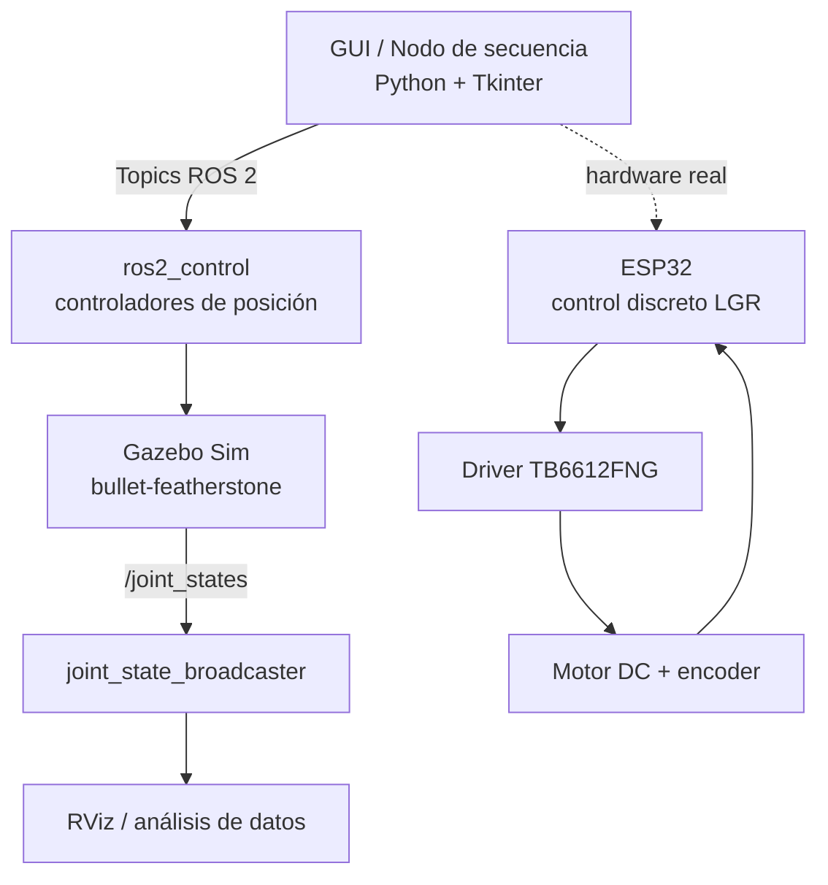

# 🤖 Robot SCARA R4: Colocación de tapas en ROS 2 + Gazebo


Control y simulación de un manipulador **SCARA de 3 grados de libertad (RRP)** que ubica tapas plásticas sobre envases de aceite dentro de una línea de envasado automatizada. Proyecto integrador de **Laboratorio de Robótica** (octavo semestre), Universidad Militar Nueva Granada.

## 👥 Autores

Diego Burgos · Sergio Boada · Geraldine Suarez · Danna Poveda

---

## 📑 Tabla de contenido

1. [Contexto del proyecto](#-contexto-del-proyecto)
2. [Arquitectura del sistema](#-arquitectura-del-sistema)
3. [Modelo cinemático](#-modelo-cinemático)
4. [Control de bajo nivel (ESP32)](#-control-de-bajo-nivel-esp32)
5. [Tecnologías](#-tecnologías-y-herramientas)
6. [Estructura del repositorio](#-estructura-del-repositorio)
7. [Cómo ejecutar la simulación](#-cómo-ejecutar-la-simulación)
8. [Resultados](#-resultados)
9. [Limitaciones y trabajo futuro](#-limitaciones-y-trabajo-futuro)

---

## 🏭 Contexto del proyecto

### El problema
En una línea industrial de envasado de aceite, el producto se manipula en varias etapas, algunas a temperaturas elevadas. La intervención humana directa implica **riesgos de seguridad** y **fatiga por tareas repetitivas**. Por eso la planta se plantea como un sistema automatizado y secuencial, donde los envases avanzan entre estaciones robotizadas.

### La misión del Robot 4 (R4)
El R4 es la estación que **coloca la tapa sobre la boca del envase** ya llenado. Su operación es de tipo *pick-and-place*:

1. Detecta que el envase está en posición en la estación.
2. Se desplaza sobre el dispensador de tapas.
3. Baja, sujeta la tapa y sube.
4. Transporta la tapa hasta la boca del envase.
5. Baja, coloca/sella la tapa, sube y regresa a Home.

El R4 **no** manipula aceite ni hace sellado térmico o roscado. Como tapas y envases llegan a posiciones predefinidas, **no se usa visión artificial**: el trabajo se concentra en cinemática, efector final, planeación de trayectorias y control de posicionamiento.

### ¿Por qué un SCARA (RRP)?
La tarea exige desplazamientos en el plano horizontal y un movimiento vertical para colocar la tapa. Se compararon dos arquitecturas por cinemática directa en RViz2:

| Criterio | Antropomórfico (RRR) | SCARA (RRP) ✅ |
|---|---|---|
| Orientación del efector | El *pitch* varía ~74.5° entre aproximación y contacto | Roll y pitch constantes (180° / 0°), efector siempre vertical |
| ¿Requiere muñeca extra? | Sí | **No** |
| Complejidad | Mayor | Menor |

La arquitectura SCARA desacopla la posición en el plano de la orientación del efector, por lo que resulta más adecuada para presionar la tapa en dirección vertical.

### Requisitos y restricciones de diseño

| Parámetro | Valor |
|---|---|
| Área de la celda | 1.25 m × 1.25 m |
| Velocidad articulaciones rotacionales (q₁, q₂) | ≤ 2 rad/s |
| Velocidad articulación prismática (q₃) | ≤ 0.15 m/s |
| Actuación | Motores DC + reductor (**sin servomotores**) |
| Retroalimentación | Encoders acoplados |
| Carga | Tapas plásticas livianas, un único tipo de tapa |
| Seguridad | Movimientos suaves, sin golpes ni colisiones |
| Sincronización | Solo opera cuando el envase está correctamente ubicado |

---

## 🧩 Arquitectura del sistema



- **En simulación:** los nodos Python publican consignas a los controladores de `ros2_control`; Gazebo resuelve la dinámica y publica el estado en `/joint_states`.
- **En hardware:** el control discreto vive en el ESP32 (borde), mientras el maestro ROS 2 orquesta estado, visualización y supervisión de alto nivel.

### Nodos y tópicos principales

| Elemento | Función |
|---|---|
| `gazebo.launch.py` | Lanza Gazebo Sim, `ros2_control` y los controladores |
| `joint3_position_hold.py` | Control P para la articulación prismática (J3) con rampa de velocidad |
| `joint_angle_gui.py` | Interfaz de sliders para mover cada articulación manualmente |
| `secuencia_gui.py` | Interfaz de **secuencia automática** pick-and-place |
| `/joint1_position_controller/commands` | Consigna de posición J1 (`Float64MultiArray`) |
| `/joint2_position_controller/commands` | Consigna de posición J2 (`Float64MultiArray`) |
| `/joint3_target` | Objetivo de J3, procesado por `joint3_position_hold.py` (`Float64`) |

---

## 📐 Modelo cinemático

Estructura **RRP**: dos juntas rotacionales en el plano horizontal y una prismática vertical. Convención: 1 unidad URDF = 10 cm reales.

**Parámetros D-H**

| Junta | Tipo | θᵢ | dᵢ | aᵢ | αᵢ |
|---|---|---|---|---|---|
| 1 | R | q₁ | L₁ | L₂ | 0° |
| 2 | R | q₂ | 0 | L₃ | 180° |
| 3 | P | 0 | q₃ | 0 | 0° |

**Posición del efector final**

```
x = L₂·cos(q₁) + L₃·cos(q₁ + q₂)
y = L₂·sin(q₁) + L₃·sin(q₁ + q₂)
z = L₁ − q₃
```

**Cinemática inversa** (forma cerrada, usada en la trayectoria cartesiana):

```
cos(q₂) = (X² + Y² − L₁² − L₂²) / (2·L₁·L₂)
q₂ = atan2(±√(1 − cos²q₂), cos q₂)
q₁ = atan2(Y, X) − atan2(L₂·sin q₂, L₁ + L₂·cos q₂)
d₃ = H_BASE − Z
```

**Límites articulares** (evitan la singularidad de brazo recto):

| Junta | Rango |
|---|---|
| J1 (base) | Continua, sin restricción |
| J2 (codo) | [0.2, 1.8] rad |
| J3 (prismática) | [−0.8, 0.1] m |

**Puntos de la tarea (cinemática directa por tanteo)**

| Posición | J1 (rad) | J2 (rad) | J3 (m) | X (cm) | Y (cm) | Z (cm) |
|---|---|---|---|---|---|---|
| Home | 3.142 | 1.800 | 0.100 | −11.59 | −14.61 | 10.50 |
| Encima de la tapa | −1.443 | 0.918 | 0.100 | 14.88 | −22.40 | 10.50 |
| Recoger tapa | −1.443 | 0.918 | −0.800 | 14.88 | −22.40 | 1.50 |
| Encima de la botella | 0.391 | 0.866 | 0.100 | 18.50 | 19.98 | 10.50 |
| Sellar tapa | 0.391 | 0.866 | −0.800 | 18.50 | 19.98 | 1.50 |

> ⚠️ **Nota sobre J3 en la simulación:** en la tabla cinemática, J3 = 0.100 es la posición alta (*hover*) y −0.800 la de contacto. En el script `secuencia_gui.py` el eje quedó **invertido** (arriba = −0.800, abajo = 0.100), así que la secuencia usa esa convención.

---

## 🎛️ Control de bajo nivel (ESP32)

Cada articulación se acciona con un motor DC, driver **TB6612FNG**, encoder incremental y un **ESP32** que ejecuta el lazo de velocidad en tiempo real.

- **Identificación** (MATLAB System Identification, modelo de primer orden, ajuste 83.53 %):

  `G(s) = 0.046814 / (1 + 0.002554·s)`

- **Controlador discreto** diseñado por Lugar Geométrico de las Raíces (ZOH, Ts = 20 ms, 50 Hz):

  `u[k] = u[k−1] + 6.9327 · (e[k] − 0.0435 · e[k−1])`

- **Criterios:** ζ = 0.8, tiempo de establecimiento < 100 ms, error estacionario ≈ 0.
- **Velocidad:** `RPM = Δpulsos / CPR · 60 / Ts`.
- Se controla **velocidad** como lazo interno, base para cinemática inversa y planificación de trayectorias.

---

## 🛠️ Tecnologías y herramientas

| Categoría | Herramienta |
|---|---|
| Middleware | ROS 2 (Lyrical) |
| Simulación | Gazebo Sim, RViz2 |
| Física | `bullet-featherstone` |
| Control | `ros2_control` (`position_controllers`, `velocity_controllers`), `joint_state_broadcaster` |
| Modelo | URDF exportado desde SolidWorks |
| Lenguajes | Python (nodos, GUI, trayectorias), XML (URDF, launch), C++ (firmware ESP32) |
| Interfaz | Tkinter (secuencia), sliders de ángulos |
| Identificación y simulación | MATLAB / Simulink |
| Hardware | ESP32, TB6612FNG, motor DC con encoder |

---

## 📁 Estructura del repositorio

```
.
├── brazo_solidworks/          # Paquete principal de ROS 2
│   ├── launch/
│   │   └── gazebo.launch.py
│   ├── scripts/
│   │   ├── joint3_position_hold.py
│   │   ├── joint_angle_gui.py
│   │   └── secuencia_gui.py
│   └── urdf/                  # Modelo del robot
└── docs/                      # Datos (.csv), informes técnicos y diagramas
    └── trayectoria_datos.csv
```

---

## 🚀 Cómo ejecutar la simulación

### 0. Compilar el workspace (primera vez o tras cambios)

```bash
cd ~/ros2_ws
colcon build --packages-select brazo_solidworks
source install/setup.bash
```

### 1. Limpieza de procesos previos (recomendado)

```bash
pkill -9 -f "gz sim"; pkill -9 -f "ruby"; pkill -9 -f "controller_manager"
pkill -9 -f "joint3_position_hold"; pkill -9 -f "joint_angle_gui"
sleep 2
```

### 2. Terminal 1: Gazebo Sim y ROS 2 Control

```bash
source ~/ros2_ws/install/setup.bash
ros2 launch brazo_solidworks gazebo.launch.py
```

Espera ~5 s hasta que abra la ventana de Gazebo y la terminal confirme que los controladores se activaron.

### 3. Terminal 2: Control P de la articulación 3

```bash
source ~/ros2_ws/install/setup.bash
python3 ~/ros2_ws/src/brazo_solidworks/scripts/joint3_position_hold.py
```

Procesa los comandos de J3 y aplica la rampa de velocidad.

### 4. Terminal 3: elegir una interfaz

**Opción A, sliders manuales:**

```bash
source ~/ros2_ws/install/setup.bash
python3 ~/ros2_ws/src/brazo_solidworks/scripts/joint_angle_gui.py
```

**Opción B, secuencia automática pick-and-place:**

```bash
source ~/ros2_ws/install/setup.bash
python3 ~/ros2_ws/src/brazo_solidworks/scripts/secuencia_gui.py
```

Pulsa **Iniciar Secuencia**. El robot recorre: Home → tapas → bajar → subir con tapa → botella → bajar para sellar → subir → Home.

### ⚙️ Ajustes de `secuencia_gui.py`

| Parámetro | Descripción |
|---|---|
| `HZ` | Pasos de interpolación por segundo (30 por defecto) |
| `USAR_CAMINO_CORTO` | Si es `True`, J1 gira por el camino más corto. Ponlo en `False` si J1 tiene límites en el URDF |
| Duración por paso | Se define en la lista `secuencia` (tiempo de movimiento y pausa por punto) |

El movimiento usa interpolación *smoothstep* para arrancar y frenar suavemente y respetar el requisito de movimientos sin golpes.

---

## 📊 Resultados

### Trayectoria cartesiana en línea recta

- **P₀ = (200, 50, 140) mm → P₁ = (100, 200, 80) mm**, T = 5 s.
- dt = 0.02 s (50 Hz) → 250 muestras, cinemática inversa en cada punto.
- Velocidades articulares por diferencias finitas hacia atrás: `dq/dt ≈ (qₖ − qₖ₋₁) / dt`.
- Torques y fuerzas extraídos de Gazebo mediante la interfaz `effort` de `ros2_control`, declarada en el URDF:

```xml
<joint name="Joint_1">
  <state_interface name="position"/>
  <state_interface name="velocity"/>
  <state_interface name="effort"/>
</joint>
```

| Variable | Comportamiento observado |
|---|---|
| X, Y, Z | Perfiles perfectamente lineales (−20, +30 y −12 mm/s) |
| τ₁ (Joint_1) | Pico de 0.1085 Nm en t = 0.06 s; régimen ≈ 0.0035 Nm |
| τ₂ (Joint_2) | Pico de 0.919 Nm en t = 0.04 s; régimen ≈ 0.4392 Nm |
| f₃ (Joint_3) | Constante ≈ −0.4472 N (sostiene el peso del eslabón), poco acoplamiento con J1 y J2 |

### Conclusiones

- La arquitectura SCARA mantiene el efector vertical sin articulación adicional.
- El control discreto por LGR corre de forma eficiente en un ESP32 con respuesta estable y rápida.
- La trayectoria discretizada a 50 Hz valida la cinemática inversa y permite analizar la dinámica de cada articulación.
- Hay diferencias entre simulación y hardware por fricción, saturación del PWM, variaciones de carga y ruido de medición.

---

## ⚠️ Limitaciones y trabajo futuro

- Sin visión artificial: tapas y envases deben estar en posiciones predefinidas.
- El efector final está diseñado para un único tipo de tapa.
- El sistema ejecuta una secuencia programada y no reemplaza la supervisión del operario.
- Pendiente: integrar la GUI con paro de emergencia, sincronización real con el sensor de presencia del envase y validación completa en hardware.

---

## 📚 Documentación

Los informes técnicos están en `/docs`:

- Descripción y requisitos del Robot 4
- Análisis cinemático por cinemática directa (SCARA vs. antropomórfico)
- Informe técnico de identificación y control LGR en ESP32
- Informe de trayectoria cartesiana y análisis dinámico en Gazebo
- Cartilla técnica del proyecto integrador

---

*Universidad Militar Nueva Granada · Facultad de Ingeniería · Ingeniería Mecatrónica · Laboratorio de Robótica*
